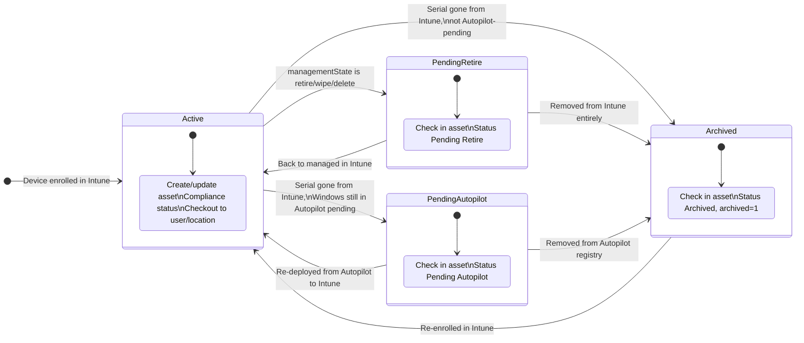
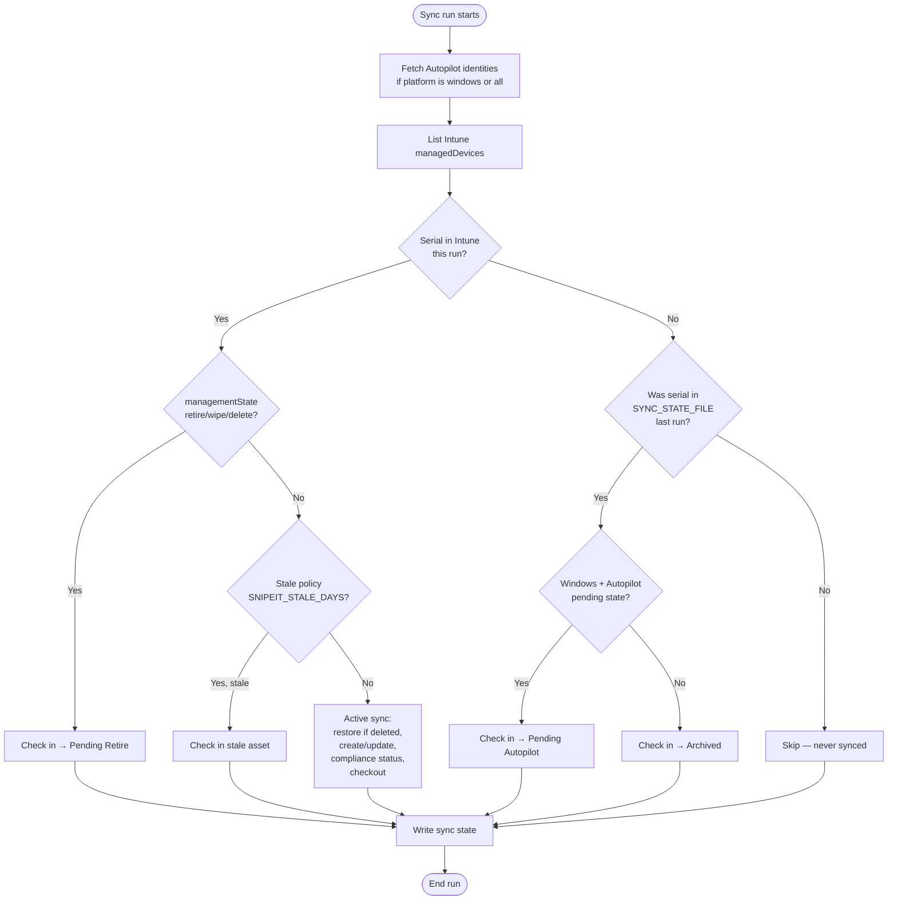

# How it works

## High-level flow

1. **Authenticate** to Microsoft Graph with Azure AD **client credentials** (daemon app).  
2. **Windows Autopilot (automatic)** — When syncing `windows` or `all`, list `windowsAutopilotDeviceIdentities` and index by serial (unless `SNIPEIT_SKIP_AUTOPILOT=true`).  
3. **Optional group filter** — If `--groups` or `AZURE_GROUP_IDS` is set, collect Azure AD **device** object IDs from those groups (`/groups/{id}/members/microsoft.graph.device`).  
4. **List Intune managed devices** — `GET /deviceManagement/managedDevices` with `$select` (and optional `$filter` by platform).  
5. **Optional primary user** — When `GRAPH_USE_PRIMARY_USER` or `--use-primary-user` is set, resolve assignees via Graph `$batch` to `/beta/deviceManagement/managedDevices/{id}/users`.  
6. **Snipe-IT setup** — Ensure category `Intune`, manufacturers, models; **status labels** must already exist.  
7. **Per device** — Restore soft-deleted assets if needed; **update** or **create**; **check out** or **check in** as needed; apply lifecycle when retiring.  
8. **Reconciliation** — When `SYNC_STATE_FILE` is set, serials seen on the prior run but missing from Intune now are moved to **Pending Autopilot** (Windows + Autopilot pending) or **Archived**.  

## Device lifecycle

The sync keeps Snipe-IT aligned with **Intune** (what is managed today) and **Windows Autopilot** (whether wiped hardware is still registered and awaiting re-deploy).

### Lifecycle diagram

### Per-run decision flow

Each scheduled run processes **Intune devices first**, then **reconciliation** (when `SYNC_STATE_FILE` is set):

**Notes:**

- **Pending Autopilot** only applies to **Windows** serials still in Autopilot with `pendingReset`, `notContacted`, `failed`, or `blocked`.
- Reconciliation needs **two runs**: the first populates `SYNC_STATE_FILE`; the second detects serials that dropped off Intune.
- When a device **returns to Active**, the next sync clears `archived` and applies compliance/checkout again.

### Lifecycle phases (reference)

| Phase | Intune | Autopilot (Windows) | Snipe action |
|-------|--------|---------------------|--------------|
| **Active** | In `managedDevices`, `managementState=managed` | Optional match; enrich notes/custom fields | Create/update; compliance → `status_id` on create **and** update; checkout as configured |
| **Retiring** | `retirePending`, `wipeIssued`, etc. | May show `pendingReset` | Check in; status **Pending Retire**; notes with `managementState` |
| **Pending Autopilot** | Absent this run | `pendingReset`, `notContacted`, `failed`, `blocked` | Check in; status **Pending Autopilot** |
| **Archived** | Absent; not Autopilot-pending | Absent or enrolled elsewhere | Check in; status **Archived**; `archived=1` |

Reconciliation requires **`SYNC_STATE_FILE`** — the app compares the previous run’s serial list to the current Intune list.

## Field mapping

| Intune (managedDevice) | Snipe-IT |
|------------------------|----------|
| `deviceName` | Asset `name` |
| `serialNumber` | Asset `serial` |
| `manufacturer` | Manufacturer / `manufacturer_id` |
| `model` | Model / `model_id` |
| `userPrincipalName` / primary user / `emailAddress` | Normalized UPN → user or location lookup → checkout |
| `managedDeviceOwnerType` = `personal` | Asset `byod` |
| `complianceState` | Optional status via `SNIPEIT_COMPLIANCE_STATUS_MAP` (create + update) |
| Autopilot `enrollmentState` / `lastContactedDateTime` | Optional custom fields (`SNIPEIT_CF_AUTOPILOT_*`) |
| Custom mappings | Snipe custom fields via `SNIPEIT_CF_*` / `SNIPEIT_CUSTOM_FIELDS` |

Android Enterprise UPNs may have a 32-character GUID prefix; the sync strips it before user lookup.

## Checkout target

By default (`SNIPEIT_CHECKOUT_MODE=user`), the app checks assets out to a Snipe-IT **user** matched by **email** or **username** (exact API filters, not fuzzy search). See [Snipe-IT API — users](https://snipe-it.readme.io/reference/users).

When `SNIPEIT_CHECKOUT_MODE=location`, the app takes the first `SNIPEIT_LOCATION_PREFIX_LENGTH` characters of the UPN local part and checks the asset out to the first Snipe-IT **location** whose name starts with that prefix. See [Snipe-IT API — hardware checkout](https://snipe-it.readme.io/reference/hardware-checkout).

Checkout and checkin calls include `status_id` from `SNIPEIT_CHECKOUT_STATUS` / `SNIPEIT_CHECKIN_STATUS` (defaulting to `SNIPEIT_DEFAULT_STATUS`). On create, assignee can be set in the same POST when `SNIPEIT_SKIP_CHECKOUT_ON_CREATE` is not set.

On updates, checkout runs again when the resolved user or location differs; checkin runs when Intune has no primary user, when a stale-device policy applies, or during lifecycle transitions.

## Soft-deleted assets

If a serial matches a soft-deleted Snipe asset, the app calls `POST /hardware/{id}/restore` before update (unless `SNIPEIT_SKIP_RESTORE_DELETED=true`).

## Group matching and Azure AD

Group filtering compares Intune’s **`azureADDeviceId`** to device IDs returned from group membership (legacy **`azureActiveDeviceId`** is accepted if present). Devices must be properly joined/registered in Azure AD for this to line up.

## Graph query optimization

Device list requests use `$select` to fetch only fields needed for sync. Platform filters use server-side `$filter` on `operatingSystem` when a single platform is selected (`windows`, `ios`, `android`, `macos`); `all` still applies a client-side macOS fallback for `"Mac"` values if Graph filter is not used.
